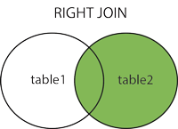
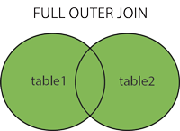

:Author:    Arafat Hasan
:Email:     <opendoor.arafat[at]gmail[dot]com>
:Date:      12 August, 2020
:Revision:  v1.0
:sectnums:
:imagesdir: ./
:toc: macro
:toc-title: Table of Content 
:toclevels: 3
:doctype: article
:source-highlighter: rouge
:rouge-style: base16.solarized.light
:rogue-css: style
:icons: font


ifdef::env-github[]
++++
<p align="center">

<p>
<h1 align="center"> PostgreSQL: The Sallow Sea </h1>
<br>
++++
endif::[]

ifndef::env-github[]
endif::[]


toc::[] 

_This writing is actually a draft note made for me so that I myself don’t forget what I have learned. For that, I think this note will be helpful for those who want to learn new Postgres._

== The Shallow Sea

=== PRIMARY KEY
The `PRIMARY KEY` of a table is a combination of `NOT NULL` and `UNIQUE` constraint. 
Here we will see how to delete and add a primary key.


At first, we check the table description, and we have found that the `id` column is a `PRIMARY KEY`.

```
\d person;
```

```
                                         Table "public.person"
      Column      |          Type          | Collation | Nullable |              Default               
------------------+------------------------+-----------+----------+------------------------------------
 id               | bigint                 |           | not null | nextval('person_id_seq'::regclass)
 first_name       | character varying(50)  |           | not null | 
 last_name        | character varying(50)  |           | not null | 
 email            | character varying(150) |           |          | 
 gender           | character varying(7)   |           | not null | 
 date_of_birth    | date                   |           | not null | 
 country_of_birth | character varying(50)  |           | not null | 
Indexes:
    "person_pkey" PRIMARY KEY, btree (id)
    
```

Now we will try to add a duplicate value to the table.

```
test=# SELECT * FROM person WHERE id=1;
 id | first_name | last_name |           email           | gender | date_of_birth | country_of_birth 
----+------------+-----------+---------------------------+--------+---------------+------------------
  1 | Ronda      | Skermer   | rskermer0@arstechnica.com | Female | 1993-06-30    | Argentina
(1 row)

test=# INSERT INTO person (id, first_name, last_name, email, gender, date_of_birth, country_of_birth) VALUES (1, 'Ronda', 'Skermer', 'rskermer0@arstechnica.com', 'Female', '1993-06-30', 'Argentina');
ERROR:  duplicate key value violates unique constraint "person_pkey"
DETAIL:  Key (id)=(1) already exists.
```


Insertion value is failed as the `id` column is primary, and it says _duplicate key value violates unique constraint_. Now we will drop the primary key constraint of the `id` column and will again try to insert duplicate data into the table.

```
test=# ALTER TABLE person DROP CONSTRAINT person_pkey;
ALTER TABLE
test=# \d person;
                                         Table "public.person"
      Column      |          Type          | Collation | Nullable |              Default               
------------------+------------------------+-----------+----------+------------------------------------
 id               | bigint                 |           | not null | nextval('person_id_seq'::regclass)
 first_name       | character varying(50)  |           | not null | 
 last_name        | character varying(50)  |           | not null | 
 email            | character varying(150) |           |          | 
 gender           | character varying(7)   |           | not null | 
 date_of_birth    | date                   |           | not null | 
 country_of_birth | character varying(50)  |           | not null | 

test=# INSERT INTO person (id, first_name, last_name, email, gender, date_of_birth, country_of_birth) VALUES (1, 'Ronda', 'Skermer', 'rskermer0@arstechnica.com', 'Female', '1993-06-30', 'Argentina');
INSERT 0 1
test=# SELECT * FROM person WHERE id=1;
 id | first_name | last_name |           email           | gender | date_of_birth | country_of_birth 
----+------------+-----------+---------------------------+--------+---------------+------------------
  1 | Ronda      | Skermer   | rskermer0@arstechnica.com | Female | 1993-06-30    | Argentina
  1 | Ronda      | Skermer   | rskermer0@arstechnica.com | Female | 1993-06-30    | Argentina
(2 rows)
```

Here, as we can see that, after dropping the primary key constrains, we can insert a duplicate row in the table.

Now we will try to add primary key constraint in the `id` column.	

```
test=# ALTER TABLE person ADD PRIMARY KEY(id);
ERROR:  could not create unique index "person_pkey"
DETAIL:  Key (id)=(1) is duplicated.
```

But we had failed, as there is two-row containing the same id. Now delete one of the duplicate ids and again try to add a primary key.

```
test=# DELETE FROM person WHERE id=1;
DELETE 2
test=# SELECT * FROM person WHERE id=1;
 id | first_name | last_name | email | gender | date_of_birth | country_of_birth 
----+------------+-----------+-------+--------+---------------+------------------
(0 rows)

test=# INSERT INTO person (id, first_name, last_name, email, gender, date_of_birth, country_of_birth) VALUES (1, 'Ronda', 'Skermer', 'rskermer0@arstechnica.com', 'Female', '1993-06-30', 'Argentina');
INSERT 0 1
test=# SELECT * FROM person WHERE id=1;
 id | first_name | last_name |           email           | gender | date_of_birth | country_of_birth 
----+------------+-----------+---------------------------+--------+---------------+------------------
  1 | Ronda      | Skermer   | rskermer0@arstechnica.com | Female | 1993-06-30    | Argentina
(1 row)

test=# ALTER TABLE person ADD PRIMARY KEY(id);
ALTER TABLE
test=# \d person;
                                         Table "public.person"
      Column      |          Type          | Collation | Nullable |              Default               
------------------+------------------------+-----------+----------+------------------------------------
 id               | bigint                 |           | not null | nextval('person_id_seq'::regclass)
 first_name       | character varying(50)  |           | not null | 
 last_name        | character varying(50)  |           | not null | 
 email            | character varying(150) |           |          | 
 gender           | character varying(7)   |           | not null | 
 date_of_birth    | date                   |           | not null | 
 country_of_birth | character varying(50)  |           | not null | 
Indexes:
    "person_pkey" PRIMARY KEY, btree (id)

test=# 

```
Our primary key constraint in the `id` column is back again.


=== CONSTRAINTS
==== UNIQUE constraint
The PostgreSQL `UNIQUE` constraint ensures that the uniqueness of the values entered into a column or a field of a table.

The `UNIQUE` constraint in PostgreSQL can be applied as a column constraint or a group of column constraint or a table constraint.

The `UNIQUE` constraint in PostgreSQL is violated when more than one row for a column or combination of columns which have been used as a unique constraint in a table. Two `NULL` values for a column in different rows are different, and it does not violate the uniqueness of the UNIQUE constraint.

When a `UNIQUE` constraint is adding, an index on a column or group of columns creates automatically.


We are going to add a `UNIQUE CONSTRAINT` in the email field, and after that, we will delete the constraint of the field.

```
test=# ALTER TABLE person ADD CONSTRAINT unique_email_addr UNIQUE(email);
ALTER TABLE
test=# \d person;
                                         Table "public.person"
      Column      |          Type          | Collation | Nullable |              Default               
------------------+------------------------+-----------+----------+------------------------------------
 id               | bigint                 |           | not null | nextval('person_id_seq'::regclass)
 first_name       | character varying(50)  |           | not null | 
 last_name        | character varying(50)  |           | not null | 
 email            | character varying(150) |           |          | 
 gender           | character varying(7)   |           | not null | 
 date_of_birth    | date                   |           | not null | 
 country_of_birth | character varying(50)  |           | not null | 
Indexes:
    "person_pkey" PRIMARY KEY, btree (id)
    "unique_email_addr" UNIQUE CONSTRAINT, btree (email)

test=# ALTER TABLE person DROP CONSTRAINT unique_email_addr;
ALTER TABLE

test=# \d person;
                                         Table "public.person"
      Column      |          Type          | Collation | Nullable |              Default               
------------------+------------------------+-----------+----------+------------------------------------
 id               | bigint                 |           | not null | nextval('person_id_seq'::regclass)
 first_name       | character varying(50)  |           | not null | 
 last_name        | character varying(50)  |           | not null | 
 email            | character varying(150) |           |          | 
 gender           | character varying(7)   |           | not null | 
 date_of_birth    | date                   |           | not null | 
 country_of_birth | character varying(50)  |           | not null | 
Indexes:
    "person_pkey" PRIMARY KEY, btree (id)

```

Again we will add unique constraints in the email field, but without mentioning the name of our constraint, the name of the constraint will be set by Postgres itself automatically.

```
test=# ALTER TABLE person ADD UNIQUE(email);
ALTER TABLE
test=# \d person;
                                         Table "public.person"
      Column      |          Type          | Collation | Nullable |              Default               
------------------+------------------------+-----------+----------+------------------------------------
 id               | bigint                 |           | not null | nextval('person_id_seq'::regclass)
 first_name       | character varying(50)  |           | not null | 
 last_name        | character varying(50)  |           | not null | 
 email            | character varying(150) |           |          | 
 gender           | character varying(7)   |           | not null | 
 date_of_birth    | date                   |           | not null | 
 country_of_birth | character varying(50)  |           | not null | 
Indexes:
    "person_pkey" PRIMARY KEY, btree (id)
    "person_email_key" UNIQUE CONSTRAINT, btree (email)

```

==== CHECK Constraint
The PostgreSQL `CHECK` constraint controls the value of a column(s) being inserted.

PostgreSQL provides the `CHECK` constraint, which allows the user to define a condition that a value entered into a table, has to satisfy before it can be accepted. The `CHECK` constraint consists of the keyword `CHECK`, followed by parenthesized conditions. The attempt will be rejected when update or insert column values that will make the condition false.

The `CHECK` constraint in PostgreSQL can be defined as a separate name.


```
test=# ALTER TABLE person ADD CONSTRAINT gender_constraint CHECK (gender = 'Female' OR gender = 'Male');
ALTER TABLE
test=# \d person;
                                         Table "public.person"
      Column      |          Type          | Collation | Nullable |              Default               
------------------+------------------------+-----------+----------+------------------------------------
 id               | bigint                 |           | not null | nextval('person_id_seq'::regclass)
 first_name       | character varying(50)  |           | not null | 
 last_name        | character varying(50)  |           | not null | 
 email            | character varying(150) |           |          | 
 gender           | character varying(7)   |           | not null | 
 date_of_birth    | date                   |           | not null | 
 country_of_birth | character varying(50)  |           | not null | 
Indexes:
    "person_pkey" PRIMARY KEY, btree (id)
    "person_email_key" UNIQUE CONSTRAINT, btree (email)
Check constraints:
    "gender_constraint" CHECK (gender::text = 'Female'::text OR gender::text = 'Male'::text)

```

=== DELETE
Following is the usage of the PostgreSQL `DELETE` command to delete data of a PostgreSQL table.

```
DELETE FROM table_name ;
```

Where `table_name` is the associated table, executing this command will delete all the rows of the associated table.

```
DELETE FROM table_name WHERE condition;
```

If we don't want to delete all of the rows of a table, but some specific rows which match the "condition", execute the above.


First, try to delete all records from a table.

```
test=# DELETE FROM person;
DELETE 1000
test=# SELECT * FROM person;
 id | first_name | last_name | email | gender | date_of_birth | country_of_birth 
----+------------+-----------+-------+--------+---------------+------------------
(0 rows)

```

There is no record in the `person` table now. For our learning purpose, retrieve data from the SQL file for the table again.

```
test=# \i /path/to/person.sql 
psql:/path/to/person.sql:9: ERROR:  relation "person" already exists
INSERT 0 1
--More--
test=# \d person;
                                         Table "public.person"
      Column      |          Type          | Collation | Nullable |              Default               
------------------+------------------------+-----------+----------+------------------------------------
 id               | bigint                 |           | not null | nextval('person_id_seq'::regclass)
 first_name       | character varying(50)  |           | not null | 
 last_name        | character varying(50)  |           | not null | 
 email            | character varying(150) |           |          | 
 gender           | character varying(7)   |           | not null | 
 date_of_birth    | date                   |           | not null | 
 country_of_birth | character varying(50)  |           | not null | 
Indexes:
    "person_pkey" PRIMARY KEY, btree (id)
    "person_email_key" UNIQUE CONSTRAINT, btree (email)
Check constraints:
    "gender_constraint" CHECK (gender::text = 'Female'::text OR gender::text = 'Male'::text)

test=# SELECT * FROM person LIMIT 10;
  id  | first_name |   last_name   |             email              | gender | date_of_birth | country_of_birth 
------+------------+---------------+--------------------------------+--------+---------------+------------------
 1002 | Ronda      | Skermer       | rskermer0@arstechnica.com      | Female | 1993-06-30    | Argentina
 1003 | Hamid      | Abbett        | habbett1@cbc.ca                | Male   | 1995-08-31    | Ethiopia
 1004 | Francis    | Nickerson     | fnickerson2@mac.com            | Male   | 1998-03-16    | Portugal
 1005 | Erminie    | M'Quharg      | emquharg3@e-recht24.de         | Female | 1999-03-13    | Mozambique
 1006 | Teodoro    | Trimmill      |                                | Male   | 1982-04-30    | China
 1007 | Reilly     | Amesbury      | ramesbury5@businessinsider.com | Male   | 1990-12-31    | China
 1008 | West       | Elphey        |                                | Male   | 2004-03-29    | Indonesia
 1009 | Letta      | Caurah        | lcaurah7@yale.edu              | Female | 1994-09-09    | Indonesia
 1010 | Elset      | Agass         | eagass8@rambler.ru             | Female | 2004-06-26    | China
 1011 | Aurore     | Drillingcourt | adrillingcourt9@cnet.com       | Female | 1977-10-19    | China
(10 rows)
```

Now try to delete a specific row or rows with the matching condition.

```
test=# DELETE FROM person WHERE id = 1002;
DELETE 1
test=# SELECT * FROM person LIMIT 10;
  id  | first_name |   last_name   |             email              | gender | date_of_birth | country_of_birth 
------+------------+---------------+--------------------------------+--------+---------------+------------------
 1003 | Hamid      | Abbett        | habbett1@cbc.ca                | Male   | 1995-08-31    | Ethiopia
 1004 | Francis    | Nickerson     | fnickerson2@mac.com            | Male   | 1998-03-16    | Portugal
 1005 | Erminie    | M'Quharg      | emquharg3@e-recht24.de         | Female | 1999-03-13    | Mozambique
 1006 | Teodoro    | Trimmill      |                                | Male   | 1982-04-30    | China
 1007 | Reilly     | Amesbury      | ramesbury5@businessinsider.com | Male   | 1990-12-31    | China
 1008 | West       | Elphey        |                                | Male   | 2004-03-29    | Indonesia
 1009 | Letta      | Caurah        | lcaurah7@yale.edu              | Female | 1994-09-09    | Indonesia
 1010 | Elset      | Agass         | eagass8@rambler.ru             | Female | 2004-06-26    | China
 1011 | Aurore     | Drillingcourt | adrillingcourt9@cnet.com       | Female | 1977-10-19    | China
 1012 | Ilse       | Goldman       | igoldmana@ihg.com              | Female | 2001-07-31    | Mongolia
(10 rows)

test=# DELETE FROM person WHERE gender='Female' AND country_of_birth='China';
DELETE 94
test=# SELECT * FROM person WHERE gender='Female' AND country_of_birth='China';
 id | first_name | last_name | email | gender | date_of_birth | country_of_birth 
----+------------+-----------+-------+--------+---------------+------------------
(0 rows)

```

For our learning purpose, now we will delete every record from the person table and restore it from our SQL file.

```
test=# DELETE FROM person;
DELETE 905
test=# \i /path/to/person.sql
psql:/path/to/person.sql:9: ERROR:  relation "person" already exists
INSERT 0 1
--More--
```


=== UPDATE
UPDATE command is used to modify existing data of a table. 

```
test=# SELECT * FROM person;
  id  |   first_name   |      last_name      |                  email                  | gender | date_of_birth |         country_of_birth         
------+----------------+---------------------+-----------------------------------------+--------+---------------+----------------------------------
 2002 | Ronda          | Skermer             | rskermer0@arstechnica.com               | Female | 1993-06-30    | Argentina
 2003 | Hamid          | Abbett              | habbett1@cbc.ca                         | Male   | 1995-08-31    | Ethiopia
 2004 | Francis        | Nickerson           | fnickerson2@mac.com                     | Male   | 1998-03-16    | Portugal
 2005 | Erminie        | M'Quharg            | emquharg3@e-recht24.de                  | Female | 1999-03-13    | Mozambique
 2006 | Teodoro        | Trimmill            |                                         | Male   | 1982-04-30    | China
 2007 | Reilly         | Amesbury            | ramesbury5@businessinsider.com          | Male   | 1990-12-31    | China
 2008 | West           | Elphey              |                                         | Male   | 2004-03-29    | Indonesia
--More--

test=# UPDATE person SET email  = 'teodoro@gmail.com' WHERE id = 2006;
UPDATE 1
test=# SELECT * FROM person WHERE id = 2006;
  id  | first_name | last_name |       email       | gender | date_of_birth | country_of_birth 
------+------------+-----------+-------------------+--------+---------------+------------------
 2006 | Teodoro    | Trimmill  | teodoro@gmail.com | Male   | 1982-04-30    | China
(1 row)

test=# UPDATE person SET last_name = 'Trimmil', email = 'teodoro@hotmail.com' WHERE id = 2006;
UPDATE 1
test=# SELECT * FROM person WHERE id = 2006;
  id  | first_name | last_name |        email        | gender | date_of_birth | country_of_birth 
------+------------+-----------+---------------------+--------+---------------+------------------
 2006 | Teodoro    | Trimmil   | teodoro@hotmail.com | Male   | 1982-04-30    | China
(1 row)


```

=== ON CONFLICT
==== DO NOTHING
This means do nothing if the row already exists in the table. It handles duplicate key errors.


First, we try to enter the duplicate record.

~_Command_~
```sql
INSERT INTO person (id, first_name, last_name, gender, email, date_of_birth, country_of_birth)
VALUES (2002, 'Ronda', 'Dante', 'Male', 'dante@hotmaill.com', DATE '1980-03-12', 'Sri Lanka');
```

As expected, an ERROR message is thrown.

~_Output_~
```
ERROR:  duplicate key value violates unique constraint "person_pkey"
DETAIL:  Key (id)=(2002) already exists.
```

Now we try to enter the duplicate record with `ON CONFLICT(id) DO NOTHING` and handle the error.

~_Command_~
```sql
INSERT INTO person (id, first_name, last_name, gender, email, date_of_birth, country_of_birth)
VALUES (2002, 'Ronda', 'Dante', 'Male', 'dante@hotmaill.com', DATE '1980-03-12', 'Sri Lanka')
ON CONFLICT(id) DO NOTHING;
```

The output message is saying `0 0`, which means no insert operation is held.

~_Output_~
```
INSERT 0 0
```

==== DO UPDATE SET
This update some fields in the table.

We will update this record in a way that conflicts with it.

```
test=# SELECT * FROM person WHERE id = 2002;
  id  | first_name | last_name |             email         | gender | date_of_birth | country_of_birth 
------+------------+-----------+---------------------------+--------+---------------+------------------
 2002 | Ronda      | Skermer   | rskermer0@arstechnica.com | Female | 1993-06-30    | Argentina
(1 row)

```

Here `EXCLUDED` refers to the new conflicted record which is trying to be inserted.

~_Command_~
```sql
INSERT INTO person (id, first_name, last_name, gender, email, date_of_birth, country_of_birth)
VALUES (2002, 'Rudi', 'Donte', 'Male', 'donte@hotmaill.com', DATE '1980-03-12', 'Sri Lanka')
ON CONFLICT(id) DO UPDATE SET first_name=EXCLUDED.first_name, last_name=EXCLUDED.last_name, email=EXCLUDED.email;
```

~_Output_~
```
INSERT 0 1
```

Despite the conflict, the updated record is:

```
test=# SELECT * FROM person WHERE id = 2002;
  id  | first_name | last_name |       email        | gender | date_of_birth | country_of_birth 
------+------------+-----------+--------------------+--------+---------------+------------------
 2002 | Rudi       | Donte     | donte@hotmaill.com | Female | 1993-06-30    | Argentina
(1 row)

```


=== Foreign Keys, Joins and Relationships
image:foreign-primary-relations.png[Forign Key, Primary Key and Relations]


Adding relations between tables
We will now drop the previous tables and create new ones with relations.

```
test=# \dt
           List of relations
 Schema |  Name  | Type  |    Owner     
--------+--------+-------+--------------
 public | car    | table | arafat_hasan
 public | person | table | arafat_hasan
(2 rows)

test=# DROP TABLE car;
DROP TABLE
test=# DROP TABLE person;
DROP TABLE
test=# \dt
Did not find any relations.  
test=# \i /path/to/new/file/car-person.sql 
CREATE TABLE
CREATE TABLE
INSERT 0 1
INSERT 0 1
INSERT 0 1
INSERT 0 1
INSERT 0 1
INSERT 0 1
INSERT 0 1
INSERT 0 1
INSERT 0 1
INSERT 0 1
INSERT 0 1
INSERT 0 1
INSERT 0 1
INSERT 0 1
INSERT 0 1
INSERT 0 1
INSERT 0 1
test=# \dt
           List of relations
 Schema |  Name  | Type  |    Owner     
--------+--------+-------+--------------
 public | car    | table | arafat_hasan
 public | person | table | arafat_hasan
(2 rows)

```


Our new SQL file, which is named `car-person.sql` is in bellow:

```sql
CREATE TABLE car (
	id BIGSERIAL NOT NULL PRIMARY KEY,
	make VARCHAR(100) NOT NULL,
	model VARCHAR(100) NOT NULL,
	price NUMERIC(19, 2) NOT NULL
);


CREATE TABLE person (
	id BIGSERIAL NOT NULL PRIMARY KEY,
	first_name VARCHAR(50) NOT NULL,
	last_name VARCHAR(50) NOT NULL,
	email VARCHAR(150),
	gender VARCHAR(7) NOT NULL,
	date_of_birth DATE NOT NULL,
	country_of_birth VARCHAR(50) NOT NULL,
	car_id BIGINT REFERENCES car(id),
	UNIQUE(car_id)
);


INSERT INTO car (make, model, price) VALUES ('Daewoo', 'Leganza', '241058.40');
INSERT INTO car (make, model, price) VALUES ('Mitsubishi', 'Montero', '269595.21');
INSERT INTO car (make, model, price) VALUES ('Kia', 'Rio', '245275.16');
INSERT INTO car (make, model, price) VALUES ('Jaguar', 'X-Type', '41665.96');
INSERT INTO car (make, model, price) VALUES ('Lincoln', 'Mark VIII', '163843.38');
INSERT INTO car (make, model, price) VALUES ('GMC', 'Rally Wagon 3500', '231169.05');
INSERT INTO car (make, model, price) VALUES ('Cadillac', 'Escalade ESV', '279951.34');


INSERT INTO person (first_name, last_name, email, gender, date_of_birth, country_of_birth) VALUES ('Hamid', 'Abbett', 'habbett1@cbc.ca', 'Male', '1995-08-31', 'Ethiopia');
INSERT INTO person (first_name, last_name, email, gender, date_of_birth, country_of_birth) VALUES ('Francis', 'Nickerson', 'fnickerson2@mac.com', 'Male', '1998-03-16', 'Portugal');
INSERT INTO person (first_name, last_name, email, gender, date_of_birth, country_of_birth) VALUES ('Erminie', 'M''Quharg', 'emquharg3@e-recht24.de', 'Female', '1999-03-13', 'Mozambique');
INSERT INTO person (first_name, last_name, email, gender, date_of_birth, country_of_birth) VALUES ('Teodoro', 'Trimmill', null, 'Male', '1982-04-30', 'China');
INSERT INTO person (first_name, last_name, email, gender, date_of_birth, country_of_birth) VALUES ('Reilly', 'Amesbury', 'ramesbury5@businessinsider.com', 'Male', '1990-12-31', 'China');
INSERT INTO person (first_name, last_name, email, gender, date_of_birth, country_of_birth) VALUES ('West', 'Elphey', null, 'Male', '2004-03-29', 'Indonesia');
INSERT INTO person (first_name, last_name, email, gender, date_of_birth, country_of_birth) VALUES ('Letta', 'Caurah', 'lcaurah7@yale.edu', 'Female', '1994-09-09', 'Indonesia');
INSERT INTO person (first_name, last_name, email, gender, date_of_birth, country_of_birth) VALUES ('Elset', 'Agass', 'eagass8@rambler.ru', 'Female', '2004-06-26', 'China');
INSERT INTO person (first_name, last_name, email, gender, date_of_birth, country_of_birth) VALUES ('Aurore', 'Drillingcourt', 'adrillingcourt9@cnet.com', 'Female', '1977-10-19', 'China');
INSERT INTO person (first_name, last_name, email, gender, date_of_birth, country_of_birth) VALUES ('Ilse', 'Goldman', 'igoldmana@ihg.com', 'Female', '2001-07-31', 'Mongolia');

```


Let's take a look at the two new tables to see what's inside.

```
test=# SELECT * FROM person;
 id | first_name |   last_name   |             email              | gender | date_of_birth | country_of_birth | car_id 
----+------------+---------------+--------------------------------+--------+---------------+------------------+--------
  1 | Hamid      | Abbett        | habbett1@cbc.ca                | Male   | 1995-08-31    | Ethiopia         |       
  2 | Francis    | Nickerson     | fnickerson2@mac.com            | Male   | 1998-03-16    | Portugal         |       
  3 | Erminie    | M'Quharg      | emquharg3@e-recht24.de         | Female | 1999-03-13    | Mozambique       |       
  4 | Teodoro    | Trimmill      |                                | Male   | 1982-04-30    | China            |       
  5 | Reilly     | Amesbury      | ramesbury5@businessinsider.com | Male   | 1990-12-31    | China            |       
  6 | West       | Elphey        |                                | Male   | 2004-03-29    | Indonesia        |       
  7 | Letta      | Caurah        | lcaurah7@yale.edu              | Female | 1994-09-09    | Indonesia        |       
  8 | Elset      | Agass         | eagass8@rambler.ru             | Female | 2004-06-26    | China            |       
  9 | Aurore     | Drillingcourt | adrillingcourt9@cnet.com       | Female | 1977-10-19    | China            |       
 10 | Ilse       | Goldman       | igoldmana@ihg.com              | Female | 2001-07-31    | Mongolia         |       
(10 rows)

test=# SELECT * FROM car;
 id |    make    |      model       |   price   
----+------------+------------------+-----------
  1 | Daewoo     | Leganza          | 241058.40
  2 | Mitsubishi | Montero          | 269595.21
  3 | Kia        | Rio              | 245275.16
  4 | Jaguar     | X-Type           |  41665.96
  5 | Lincoln    | Mark VIII        | 163843.38
  6 | GMC        | Rally Wagon 3500 | 231169.05
  7 | Cadillac   | Escalade ESV     | 279951.34
(7 rows)

```


As expected, there is no value in the `car_id` column in `person` as we did not insert any value there.

As can be seen below, we have set the foreign key correctly, and it has a UNIQUE constraint and `car_id` referencing to `car.id`.

```
test=# \d person;
                                         Table "public.person"
      Column      |          Type          | Collation | Nullable |              Default               
------------------+------------------------+-----------+----------+------------------------------------
 id               | bigint                 |           | not null | nextval('person_id_seq'::regclass)
 first_name       | character varying(50)  |           | not null | 
 last_name        | character varying(50)  |           | not null | 
 email            | character varying(150) |           |          | 
 gender           | character varying(7)   |           | not null | 
 date_of_birth    | date                   |           | not null | 
 country_of_birth | character varying(50)  |           | not null | 
 car_id           | bigint                 |           |          | 
Indexes:
    "person_pkey" PRIMARY KEY, btree (id)
    "person_car_id_key" UNIQUE CONSTRAINT, btree (car_id)
Foreign-key constraints:
    "person_car_id_fkey" FOREIGN KEY (car_id) REFERENCES car(id)


```


Let's assign the Mitsubishi, which ID is 2 from the car table to Hamid Abbett of the person table which ID is 1.

```
test=# UPDATE person SET car_id = 2 WHERE id = 1;
UPDATE 1
test=# SELECT * FROM person;
 id | first_name |   last_name   |             email              | gender | date_of_birth | country_of_birth | car_id 
----+------------+---------------+--------------------------------+--------+---------------+------------------+--------
  2 | Francis    | Nickerson     | fnickerson2@mac.com            | Male   | 1998-03-16    | Portugal         |       
  3 | Erminie    | M'Quharg      | emquharg3@e-recht24.de         | Female | 1999-03-13    | Mozambique       |       
  4 | Teodoro    | Trimmill      |                                | Male   | 1982-04-30    | China            |       
  5 | Reilly     | Amesbury      | ramesbury5@businessinsider.com | Male   | 1990-12-31    | China            |       
  6 | West       | Elphey        |                                | Male   | 2004-03-29    | Indonesia        |       
  7 | Letta      | Caurah        | lcaurah7@yale.edu              | Female | 1994-09-09    | Indonesia        |       
  8 | Elset      | Agass         | eagass8@rambler.ru             | Female | 2004-06-26    | China            |       
  9 | Aurore     | Drillingcourt | adrillingcourt9@cnet.com       | Female | 1977-10-19    | China            |       
 10 | Ilse       | Goldman       | igoldmana@ihg.com              | Female | 2001-07-31    | Mongolia         |       
  1 | Hamid      | Abbett        | habbett1@cbc.ca                | Male   | 1995-08-31    | Ethiopia         |      2
(10 rows)

```

Let's also add a car to Francis Nickerson.

```
UPDATE person SET car_id = 1 WHERE id = 2;
```

Let's try to give one car to two people and see what happens.

```
test=# UPDATE person SET car_id = 1 WHERE id = 3;
ERROR:  duplicate key value violates unique constraint "person_car_id_key"
DETAIL:  Key (car_id)=(1) already exists.
```

Okay, now assign other cars to specific persons. This is the final table.

```
 id | first_name |   last_name   |             email              | gender | date_of_birth | country_of_birth | car_id 
----+------------+---------------+--------------------------------+--------+---------------+------------------+--------
  5 | Reilly     | Amesbury      | ramesbury5@businessinsider.com | Male   | 1990-12-31    | China            |       
  9 | Aurore     | Drillingcourt | adrillingcourt9@cnet.com       | Female | 1977-10-19    | China            |       
 10 | Ilse       | Goldman       | igoldmana@ihg.com              | Female | 2001-07-31    | Mongolia         |       
  1 | Hamid      | Abbett        | habbett1@cbc.ca                | Male   | 1995-08-31    | Ethiopia         |      2
  2 | Francis    | Nickerson     | fnickerson2@mac.com            | Male   | 1998-03-16    | Portugal         |      1
  3 | Erminie    | M'Quharg      | emquharg3@e-recht24.de         | Female | 1999-03-13    | Mozambique       |      7
  4 | Teodoro    | Trimmill      |                                | Male   | 1982-04-30    | China            |      5
  8 | Elset      | Agass         | eagass8@rambler.ru             | Female | 2004-06-26    | China            |      4
  7 | Letta      | Caurah        | lcaurah7@yale.edu              | Female | 1994-09-09    | Indonesia        |      6
  6 | West       | Elphey        |                                | Male   | 2004-03-29    | Indonesia        |      3
(10 rows)

```

==== Delete Record with Foreign Keys


```
test=# DELETE FROM car WHERE id = 7;
ERROR:  update or delete on table "car" violates foreign key constraint "person_car_id_fkey" on table "person"
DETAIL:  Key (id)=(7) is still referenced from table "person".
test=# DELETE FROM person WHERE id = 3;
DELETE 1
test=# SELECT * FROM person;
 id | first_name |   last_name   |             email              | gender | date_of_birth | country_of_birth | car_id 
----+------------+---------------+--------------------------------+--------+---------------+------------------+--------
  5 | Reilly     | Amesbury      | ramesbury5@businessinsider.com | Male   | 1990-12-31    | China            |       
  9 | Aurore     | Drillingcourt | adrillingcourt9@cnet.com       | Female | 1977-10-19    | China            |       
 10 | Ilse       | Goldman       | igoldmana@ihg.com              | Female | 2001-07-31    | Mongolia         |       
  1 | Hamid      | Abbett        | habbett1@cbc.ca                | Male   | 1995-08-31    | Ethiopia         |      2
  2 | Francis    | Nickerson     | fnickerson2@mac.com            | Male   | 1998-03-16    | Portugal         |      1
  4 | Teodoro    | Trimmill      |                                | Male   | 1982-04-30    | China            |      5
  8 | Elset      | Agass         | eagass8@rambler.ru             | Female | 2004-06-26    | China            |      4
  7 | Letta      | Caurah        | lcaurah7@yale.edu              | Female | 1994-09-09    | Indonesia        |      6
  6 | West       | Elphey        |                                | Male   | 2004-03-29    | Indonesia        |      3
(9 rows)
```

It turns out that we can't delete a record which is assigned with the `person` table from the `car` table, but we can delete any record from the `person` table. This is because there is a relation from the `person` table to the `car` table.

To delete a record from the `car` table, we have to delete the corresponding record in the `person` table or set the `car_id` of that record to NULL.


=== JOIN
A JOIN clause is used to combine rows from two or more tables, based on a related column between them.

==== INNER JOIN

The INNER JOIN keyword selects records that have matching values in both tables.

The INNER JOIN creates a new result table by combining column values of two tables (table1 and table2) based upon the join-predicate. The query compares each row of table1 with each row of table2 to find all pairs of rows which satisfy the join-predicate. When the join-predicate is satisfied, column values for each matched pair of rows of A and B are combined into a result row.

```sql
SELECT column_name(s)
FROM table1
INNER JOIN table2
ON table1.column_name = table2.column_name;
```

image:inner-join.gif[INNER JOIN]


Now let's join our tables based on foreign keys.

~_Command_~
```sql
SELECT * FROM person
JOIN car ON person.car_id = car.id;
```

~_Output_~
```
 id | first_name | last_name |         email          | gender | date_of_birth | country_of_birth | car_id | id |    make    |      model       |   price   
----+------------+-----------+------------------------+--------+---------------+------------------+--------+----+------------+------------------+-----------
  2 | Francis    | Nickerson | fnickerson2@mac.com    | Male   | 1998-03-16    | Portugal         |      1 |  1 | Daewoo     | Leganza          | 241058.40
  1 | Hamid      | Abbett    | habbett1@cbc.ca        | Male   | 1995-08-31    | Ethiopia         |      2 |  2 | Mitsubishi | Montero          | 269595.21
  6 | West       | Elphey    |                        | Male   | 2004-03-29    | Indonesia        |      3 |  3 | Kia        | Rio              | 245275.16
  8 | Elset      | Agass     | eagass8@rambler.ru     | Female | 2004-06-26    | China            |      4 |  4 | Jaguar     | X-Type           |  41665.96
  4 | Teodoro    | Trimmill  |                        | Male   | 1982-04-30    | China            |      5 |  5 | Lincoln    | Mark VIII        | 163843.38
  7 | Letta      | Caurah    | lcaurah7@yale.edu      | Female | 1994-09-09    | Indonesia        |      6 |  6 | GMC        | Rally Wagon 3500 | 231169.05
  3 | Erminie    | M'Quharg  | emquharg3@e-recht24.de | Female | 1999-03-13    | Mozambique       |      7 |  7 | Cadillac   | Escalade ESV     | 279951.34
(7 rows)

```

~_Command_~
```sql
SELECT person.first_name, person.last_name, car.make, car.model, car.price
FROM person
JOIN car ON person.car_id = car.id;
```

~_Output_~
```
 first_name | last_name |    make    |      model       |   price   
------------+-----------+------------+------------------+-----------
 Francis    | Nickerson | Daewoo     | Leganza          | 241058.40
 Hamid      | Abbett    | Mitsubishi | Montero          | 269595.21
 West       | Elphey    | Kia        | Rio              | 245275.16
 Elset      | Agass     | Jaguar     | X-Type           |  41665.96
 Teodoro    | Trimmill  | Lincoln    | Mark VIII        | 163843.38
 Letta      | Caurah    | GMC        | Rally Wagon 3500 | 231169.05
 Erminie    | M'Quharg  | Cadillac   | Escalade ESV     | 279951.34
(7 rows)

```

==== LEFT JOIN

The LEFT JOIN keyword returns all records from the left table (table1), and the matched records from the right table (table2). The result is NULL from the right side, if there is no match.

image:left-join.gif[LEFT JOIN]

~_Command_~
```sql
SELECT person.first_name, person.last_name, car.make, car.model, car.price
FROM person
LEFT JOIN car ON person.car_id = car.id;

```

~_Output_~
```
 first_name |   last_name   |    make    |      model       |   price   
------------+---------------+------------+------------------+-----------
 Francis    | Nickerson     | Daewoo     | Leganza          | 241058.40
 Hamid      | Abbett        | Mitsubishi | Montero          | 269595.21
 West       | Elphey        | Kia        | Rio              | 245275.16
 Elset      | Agass         | Jaguar     | X-Type           |  41665.96
 Teodoro    | Trimmill      | Lincoln    | Mark VIII        | 163843.38
 Letta      | Caurah        | GMC        | Rally Wagon 3500 | 231169.05
 Erminie    | M'Quharg      | Cadillac   | Escalade ESV     | 279951.34
 Ilse       | Goldman       |            |                  |          
 Aurore     | Drillingcourt |            |                  |          
 Reilly     | Amesbury      |            |                  |          
(10 rows)

```


==== RIGHT JOIN
The RIGHT JOIN keyword returns all records from the right table (table2), and the matched records from the left table (table1). The result is NULL from the left side, when there is no match.





==== FULL OUTER JOIN
The FULL OUTER JOIN keyword returns all records when there are a match in left (table1) or right (table2) table records.

Note: FULL OUTER JOIN can potentially return very large result-sets!

FULL OUTER JOIN and FULL JOIN are the same.




=== Exporting Query Results to CSV


By typing `\?` and check the help. In the Input/Output section, it says that `\copy ...    perform SQL COPY with data stream to the client host`.


We will save this query to a CSV file.

```
test=# SELECT person.first_name, person.last_name, car.make, car.model, car.price
FROM person
LEFT JOIN car ON person.car_id = car.id;
 first_name |   last_name   |    make    |      model       |   price   
------------+---------------+------------+------------------+-----------
 Francis    | Nickerson     | Daewoo     | Leganza          | 241058.40
 Hamid      | Abbett        | Mitsubishi | Montero          | 269595.21
 West       | Elphey        | Kia        | Rio              | 245275.16
 Elset      | Agass         | Jaguar     | X-Type           |  41665.96
 Teodoro    | Trimmill      | Lincoln    | Mark VIII        | 163843.38
 Letta      | Caurah        | GMC        | Rally Wagon 3500 | 231169.05
 Ilse       | Goldman       |            |                  |          
 Aurore     | Drillingcourt |            |                  |          
 Reilly     | Amesbury      |            |                  |          
(9 rows)

```


~_Command_~
```sql
\copy (SELECT person.first_name, person.last_name, car.make, car.model, car.price FROM person LEFT JOIN car ON car.id = person.car_id) TO '/home/arafat_hasan/Downloads/results.csv' DELIMITER ',' CSV HEADER

```
~_Output_~
```
COPY 9

```
The query is stored in the CSV file.


=== Serials and Sequences
```
test=# \d person;
                                         Table "public.person"
      Column      |          Type          | Collation | Nullable |              Default               
------------------+------------------------+-----------+----------+------------------------------------
 id               | bigint                 |           | not null | nextval('person_id_seq'::regclass)
 first_name       | character varying(50)  |           | not null | 
 last_name        | character varying(50)  |           | not null | 
 email            | character varying(150) |           |          | 
 gender           | character varying(7)   |           | not null | 
 date_of_birth    | date                   |           | not null | 
 country_of_birth | character varying(50)  |           | not null | 
 car_id           | bigint                 |           |          | 
Indexes:
    "person_pkey" PRIMARY KEY, btree (id)
    "person_car_id_key" UNIQUE CONSTRAINT, btree (car_id)
Foreign-key constraints:
    "person_car_id_fkey" FOREIGN KEY (car_id) REFERENCES car(id)

test=# SELECT * FROM person_id_seq ;
 last_value | log_cnt | is_called 
------------+---------+-----------
         10 |      23 | t
(1 row)

test=# SELECT nextval('person_id_seq'::regclass);
 nextval 
---------
      11
(1 row)

test=# SELECT nextval('person_id_seq'::regclass);
 nextval 
---------
      12
(1 row)

test=# SELECT * FROM person_id_seq ;
 last_value | log_cnt | is_called 
------------+---------+-----------
         12 |      32 | t
(1 row)

test=# ALTER SEQUENCE person_id_seq RESTART WITH 10;
ALTER SEQUENCE
test=# SELECT * FROM person_id_seq ;
 last_value | log_cnt | is_called 
------------+---------+-----------
         10 |       0 | f
(1 row)

```


=== Extensions

Simply extensions are functions that can add extra functionality to the database.

List of available extensions

```
test=# SELECT * FROM pg_available_extensions;
  name   | default_version | installed_version |           comment            
---------+-----------------+-------------------+------------------------------
 plpgsql | 1.0             | 1.0               | PL/pgSQL procedural language
(1 row)

```

=== UUID Datatype

From wikipedia:
[quote]
____
A universally unique identifier (UUID) is a 128-bit number used to identify information in computer systems. The term globally unique identifier (GUID) is also used, typically in software created by Microsoft.

When generated according to the standard methods, UUIDs are, for practical purposes, unique. Their uniqueness does not depend on a central registration authority or coordination between the parties generating them, unlike most other numbering schemes. While the probability that a UUID will be duplicated is not zero, it is close enough to zero to be negligible. 
____


We have to add the uuid-ossp extension:
```
CREATE EXTENSION "uuid-ossp";
```

List of a available functions:

```
\df
```

Now we have to invoke the function:
```
SELECT uuid_generate_v4();
```

```
ANLONGUUID
```

==== UUID as Primary Key

Drop `person` and `car` table and create another ones as below.


```sql
CREATE TABLE car (
	car_uid UUID NOT NULL PRIMARY KEY,
	make VARCHAR(100) NOT NULL,
	model VARCHAR(100) NOT NULL,
	price NUMERIC(19, 2) NOT NULL
);


CREATE TABLE person (
	person_uid UUID NOT NULL PRIMARY KEY,
	first_name VARCHAR(50) NOT NULL,
	last_name VARCHAR(50) NOT NULL,
	email VARCHAR(150),
	gender VARCHAR(7) NOT NULL,
	date_of_birth DATE NOT NULL,
	country_of_birth VARCHAR(50) NOT NULL,
	car_uid UUID REFERENCES car(car_uid),
	UNIQUE(car_uid),
	UNIQUE(email)
);


INSERT INTO car (car_uid, make, model, price) 
VALUES (uuid_generate_v4(), uuid_generate_v4(), 'Mitsubishi', 'Montero', '269595.21');

INSERT INTO car (car_uid, make, model, price) 
VALUES (uuid_generate_v4(), uuid_generate_v4(), 'Kia', 'Rio', '245275.16');

INSERT INTO car (car_uid, make, model, price) 
VALUES (uuid_generate_v4(), uuid_generate_v4(), 'Jaguar', 'X-Type', '41665.96');

INSERT INTO car (car_uid, make, model, price) 
VALUES (uuid_generate_v4(), uuid_generate_v4(), 'Lincoln', 'Mark VIII', '163843.38');


INSERT INTO person (person_uid, first_name, last_name, email, gender, date_of_birth, country_of_birth) 
VALUES (uuid_generate_v4(), uuid_generate_v4(), 'Hamid', 'Abbett', 'habbett1@cbc.ca', 'Male', '1995-08-31', 'Ethiopia');

INSERT INTO person (person_uid, first_name, last_name, email, gender, date_of_birth, country_of_birth) 
VALUES (uuid_generate_v4(), uuid_generate_v4(), 'Francis', 'Nickerson', 'fnickerson2@mac.com', 'Male', '1998-03-16', 'Portugal');

INSERT INTO person (person_uid, first_name, last_name, email, gender, date_of_birth, country_of_birth) 
VALUES (uuid_generate_v4(), uuid_generate_v4(), 'Erminie', 'M''Quharg', 'emquharg3@e-recht24.de', 'Female', '1999-03-13', 'Mozambique');

INSERT INTO person (person_uid, first_name, last_name, email, gender, date_of_birth, country_of_birth) 
VALUES (uuid_generate_v4(), uuid_generate_v4(), 'Teodoro', 'Trimmill', null, 'Male', '1982-04-30', 'China');

INSERT INTO person (person_uid, first_name, last_name, email, gender, date_of_birth, country_of_birth) 
VALUES (uuid_generate_v4(), uuid_generate_v4(), 'Reilly', 'Amesbury', 'ramesbury5@businessinsider.com', 'Male', '1990-12-31', 'China');

INSERT INTO person (person_uid, first_name, last_name, email, gender, date_of_birth, country_of_birth) 
VALUES (uuid_generate_v4(), uuid_generate_v4(), 'West', 'Elphey', null, 'Male', '2004-03-29', 'Indonesia');

INSERT INTO person (person_uid, first_name, last_name, email, gender, date_of_birth, country_of_birth) 
VALUES (uuid_generate_v4(), uuid_generate_v4(), 'Letta', 'Caurah', 'lcaurah7@yale.edu', 'Female', '1994-09-09', 'Indonesia');

```

